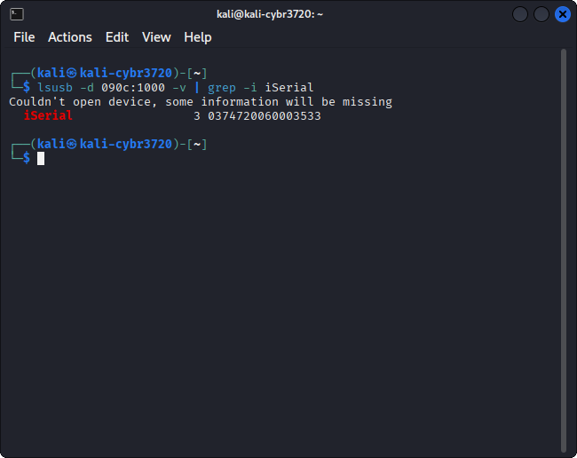

#

## Instructions

The purpose of this lab is to make sure that you're able to boot off of your Kali thumb drive and to do a few tasks.

## Questions

### Question 1

Boot into Kali Linux. Change the background image to one that you will recognize and know that you're successfully booted the image for this class. Take a screenshot of your newly customized background and upload it as an attachment to this question.

Here is an example:

### Question 2

We want to record what the IP and MAC (physical) addresses are for the wired network adapter on our lab machines. In Kali Linux, launch the terminal application and run the following command:

`ip address show eth0`

Take a screenshot of the terminal window with the command and results and upload it as an attachment to this question.

Here is an example:

### Question 3

We want to record what the IP and MAC (physical) addresses are for the wireless network adapter on our lab machines. In Kali Linux, launch the terminal application and run the following command:

`ip address show wlan1`

Take a screenshot of the terminal window with the command and results and upload it as an attachment to this question.

Here is an example:

### Question 4

We want to record what the serial number of the thumb drive that has been checked out to us is. In Kali Linux, launch the terminal application and run the following command:

`lsusb -d 090c:1000 -v | grep -i iSerial`

Take a screenshot of the terminal window with the command and results and upload it as an attachment to this question.

Here is an example:

