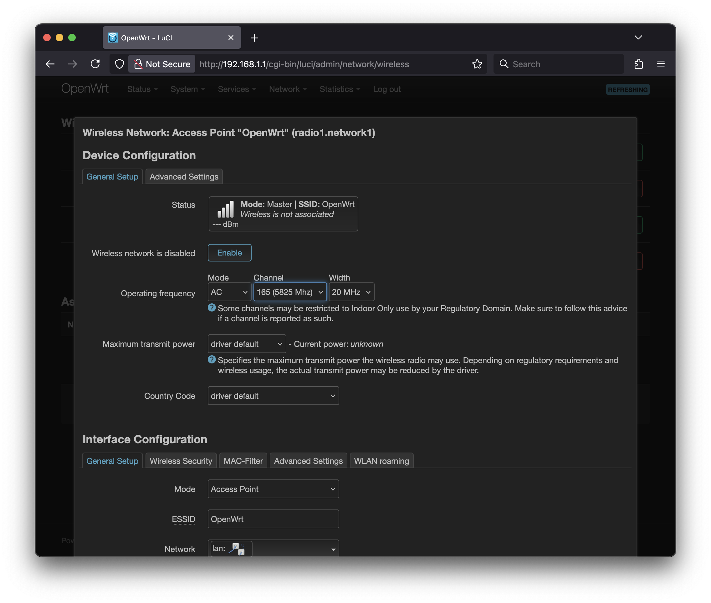
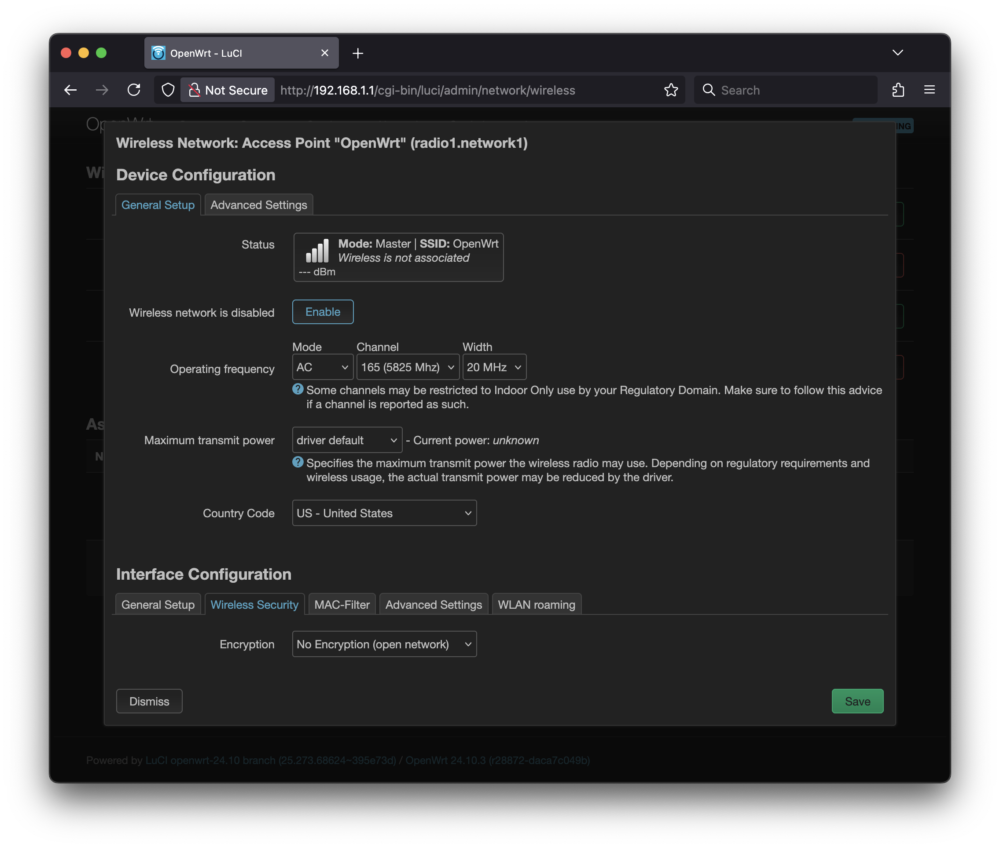

# Setting up a basic SSID in OpenWRT

## Introduction

We're going to try out OpenWRT, a popular open-source firmware for routers and embedded devices. We're going to go a bit off of the beaten path by using an x86 computer to boot OpenWRT via Ventoy.

You will need to get the OpenWRT image for the course from the instructor.

## Directions

After you have the OpenWRT image on your USB drive, plug it into your computer and boot from it. On the lab machines, you'll need to hit F12 during the boot process to select the USB drive as the boot device.

Select the OpenWRT option from the Ventoy menu.

## Deliverables

### Question 1

This lab requires multiple computers, so you might need to work with a lab partner. If you do, please include their name in the LMS.

### Question 2

After you have set up your open SSID, take a screen shot of the "Wireless Overview" page of the OpenWrt WebUI. Upload that screenshot to the LMS.

Here is an example of what I'm looking for:

### Question 3

After you have set up your open SSID, capture beacons from it using Kismet. Take a screenshot of the "Wi-Fi (802.11)" section of the Device Info page for your AP. Make sure that it includes the SSID, the Encryption type, the Channel, and the 802.11d Country. Upload that screenshot to the LMS.

Here is an example of what I'm looking for:

### Question 4

After you have set up your WPA2 SSID, take a screen shot of the "Wireless Overview" page of the OpenWrt WebUI. Upload that screenshot to the LMS.

Here is an example of what I'm looking for:

### Question 5

After you have set up your WPA2 SSID, capture beacons from it using Kismet. Take a screenshot of the "Wi-Fi (802.11)" section of the Device Info page for your AP. Make sure that it includes the SSID, the Encryption type, the Channel, and the 802.11d Country. Upload that screenshot to the LMS.

Here is an example of what I'm looking for:

