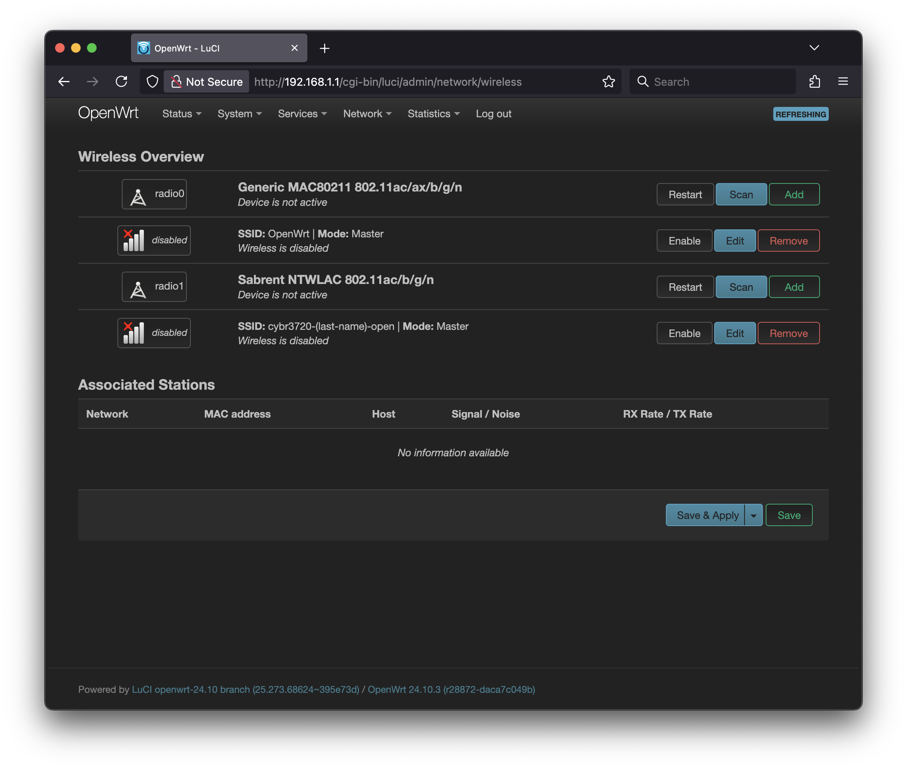

# Setting up a basic SSID in OpenWrt

## Introduction

We're going to try out OpenWrt, a popular open-source firmware for routers and embedded devices. We're going to go a bit off of the beaten path by using an x86 computer to boot OpenWrt via Ventoy.

You will need to get the OpenWrt image for the course from the instructor.

## Directions

After you have the OpenWrt image on your USB drive, plug it into your computer and boot from it. On the computer, you'll need to hit a key on bootup to go into the boot menu (F12 on our lab machines). Once in that menu, select the USB drive as the boot device.

Select the OpenWrt option from the Ventoy menu and hit enter. You will see a boot menu for OpenWrt; you can either hit enter on the default option or wait for the timer to expire. You will see the OpenWrt boot messages scroll by. After a minute or so, the messages will stop scrolling and you might see a login prompt. If you do not, you can hit enter to bring it up.

We actually do not need to use the OpenWrt command line for this lab, so you can ignore the login prompt. Instead, plug a second computer into the network port of the computer running OpenWrt. The computer running OpenWrt will act as a DHCP server and assign an IP address to the second computer. On the second computer, open a web browser and go to <http://192.168.1.1>. You should see the OpenWrt WebUI login page. There is no password set by default, so just hit enter or click the "Log in" button.

You will be presetned with the default Status page of OpenWrt. At the top you will see a banner asking you to set a root password. If we don't set one, we will have this banner at the top of every page we visit. Click on the "Go to password configuration button.

Set a password and click the "Save & Apply" button. You will be returned to the Status page, and the banner will be gone.

Now we're back to the Status page. From here, click on the "Network" menu at the top and select "Wireless" from the dropdown.

This page shows all of the Wi-Fi radios in the system. There might be one or more. The radio for the Panda Wireless adapter provided for the course should have a label of "Sabrent NTWLAC 802.11ac/b/g/n". In my example screenshot, it is the second radio; which has the label "radio1". We want to modify the SSID for this radio, so click on the "Edit" button for the SSID directly after the radio we've been discussing.

This is the configuration page for the SSID.

 The default configuration is to create an SSID named "OpenWrt". Change the "ESSID" field from OpenWrt to something unique, like "cybr3720-\<your-last-name\>-open".

Next click on the Wireless Security tab. This is where we can set up encryption for the SSID. For now, leave it as "No Encryption". Click the "Save" button at the bottom of the page.

## Deliverables

### Question 1

This lab requires multiple computers, so you might need to work with a lab partner. If you do, please include their name in the LMS.

### Question 2

After you have set up your open SSID, take a screen shot of the "Wireless Overview" page of the OpenWrt WebUI. Upload that screenshot to the LMS.

Here is an example of what I'm looking for:

### Question 3

After you have set up your open SSID, capture beacons from it using Kismet. Take a screenshot of the "Wi-Fi (802.11)" section of the Device Info page for your AP. Make sure that it includes the SSID, the Encryption type, the Channel, and the 802.11d Country. Upload that screenshot to the LMS.

Here is an example of what I'm looking for:

### Question 4

After you have set up your WPA2 SSID, take a screen shot of the "Wireless Overview" page of the OpenWrt WebUI. Upload that screenshot to the LMS.

Here is an example of what I'm looking for:

### Question 5

After you have set up your WPA2 SSID, capture beacons from it using Kismet. Take a screenshot of the "Wi-Fi (802.11)" section of the Device Info page for your AP. Make sure that it includes the SSID, the Encryption type, the Channel, and the 802.11d Country. Upload that screenshot to the LMS.

Here is an example of what I'm looking for:

