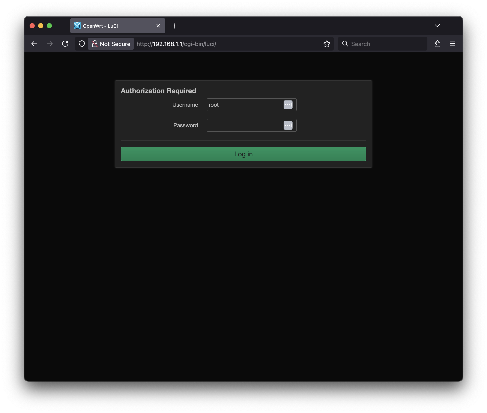
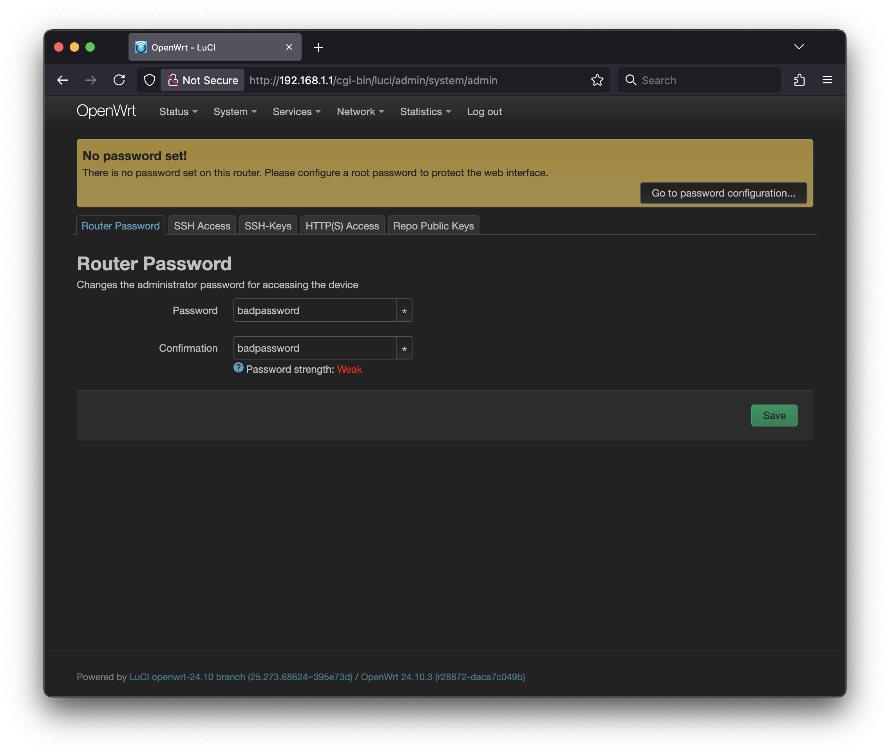
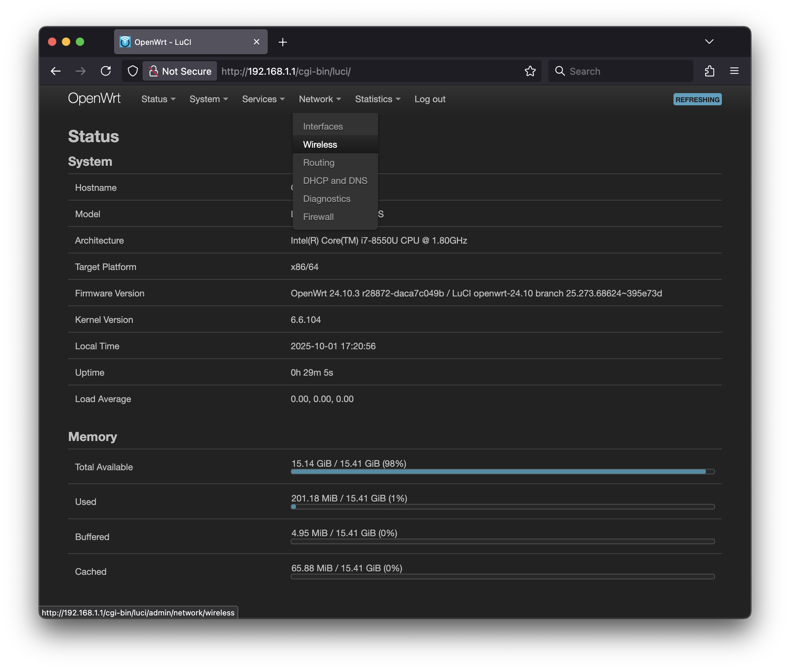
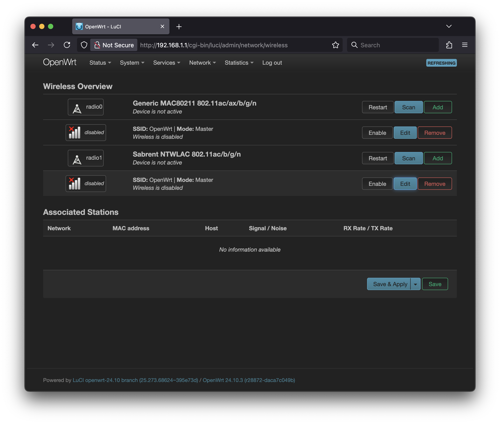
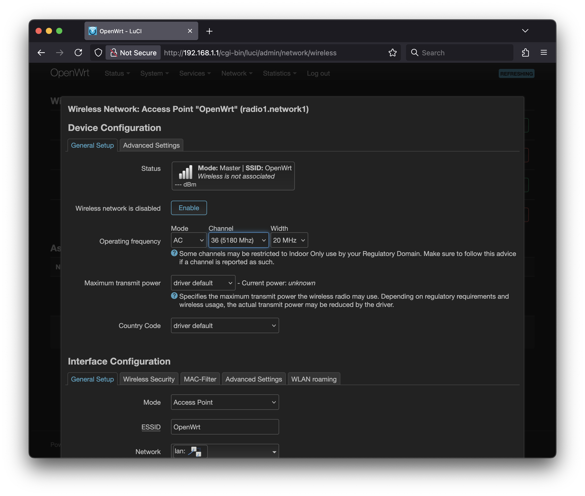
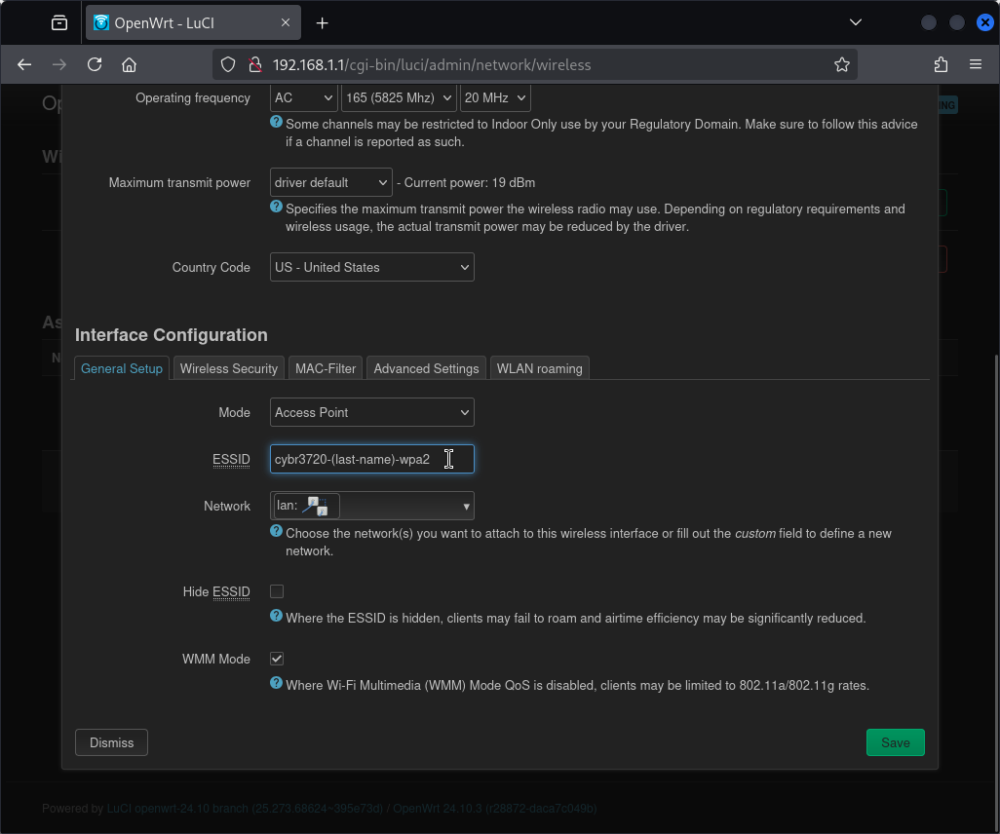
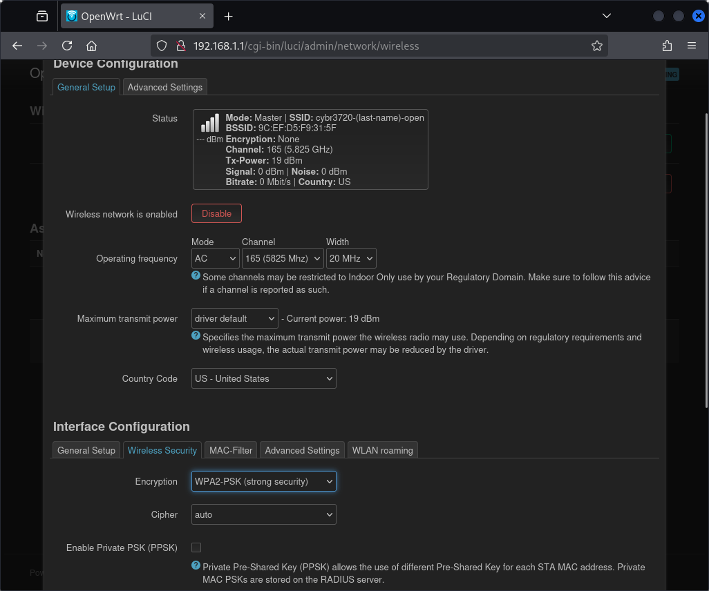
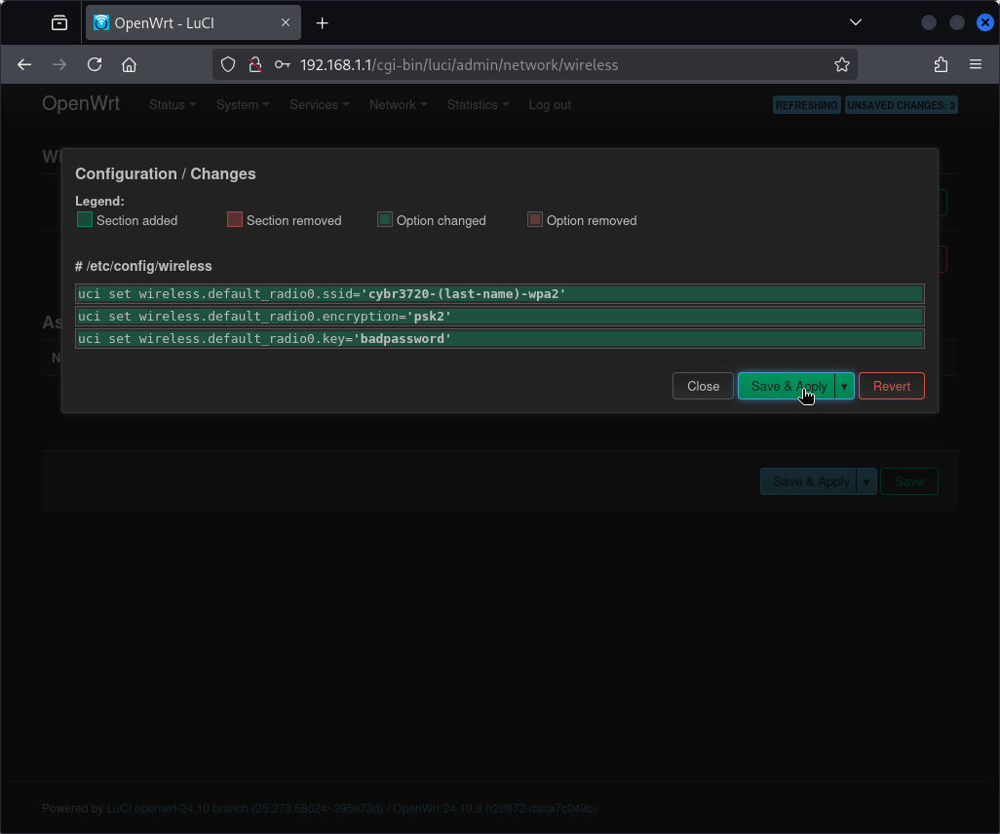

# Setting up a WPA2-PSK SSID in OpenWrt

## Introduction

We're going to try out OpenWrt, a popular open-source firmware for routers and embedded devices. We're going to go a bit off of the beaten path by using an x86 computer to boot OpenWrt via Ventoy. In this lab, you'll learn how to configure a secure wireless network using WPA2-PSK encryption.

You will need to get the OpenWrt image for the course from the instructor.

## Directions

After you have the OpenWrt image on your USB drive, plug it into your computer and boot from it. On the computer, you'll need to hit a key on bootup to go into the boot menu (F12 on our lab machines). Once in that menu, select the USB drive as the boot device.

Select the OpenWrt option from the Ventoy menu and hit enter. You will see a boot menu for OpenWrt; you can either hit enter on the default option or wait for the timer to expire. You will see the OpenWrt boot messages scroll by. After a minute or so, the messages will stop scrolling and you might see a login prompt. If you do not, you can hit enter to bring it up.

### Logging in and setting a password

We actually do not need to use the OpenWrt command line for this lab, so you can ignore the login prompt. Instead, plug a second computer into the network port of the computer running OpenWrt. The computer running OpenWrt will act as a DHCP server and assign an IP address to the second computer. On the second computer, open a web browser and go to <http://192.168.1.1>. You should see the OpenWrt WebUI login page. There is no password set by default, so just hit enter or click the "Log in" button.

You will be presented with the default Status page of OpenWrt. At the top you will see a banner asking you to set a root password. If we don't set one, we will have this banner at the top of every page we visit. Click on the "Go to password configuration" button.

Set a password and click the "Save & Apply" button. You will be returned to the Status page, and the banner will be gone. The Status page shows an overview of your system including the router's current configuration and resource usage:

### Setting up a WPA2-PSK SSID

Now, let's configure a wireless network. Click on the "Network" menu at the top and select "Wireless" from the dropdown.

This page shows all of the Wi-Fi radios in the system. There might be one or more. The radio for the Panda Wireless adapter provided for the course should have a label of "Sabrent NTWLAC 802.11ac/b/g/n". In my example screenshot, it is the second radio, which has the label "radio1". We want to modify the SSID for this radio, so click on the "Edit" button for the SSID directly after the radio we've been discussing.

#### Setting the channel width

This is the configuration page for the SSID. This page has multiple tabs where you can configure different aspects of the wireless network. On the "General Setup" tab, you'll see various configuration options. Scroll down to find the channel width setting and change it to 20MHz:

#### Selecting a channel

Continue scrolling through the remaining configuration options:

Locate the channel setting and change it to channel 165.

#### Setting the SSID

The default configuration is to create an SSID named "OpenWrt". Change the "ESSID" field from OpenWrt to something unique, like "cybr3720-\<your-last-name\>-wpa2".

#### Setting the encryption type

After entering your SSID name, click on the "Wireless Security" tab. This is where we can set up encryption for the SSID. We'll configure WPA2-PSK to secure this network.

On the Wireless Security tab, click on the "Encryption" dropdown menu and select "WPA2-PSK" (or "WPA2-PSK/WPA3-SAE Mixed Mode" if available). This will enable WPA2 Personal security.

After selecting WPA2-PSK, a new field will appear for the "Key" (password). Enter a strong password for your network that meets the minimum requirements (usually at least 8 characters). Review the cipher and other security settings - the defaults (CCMP/AES) are typically the most secure option. Once you've entered your password and reviewed the settings, scroll to the bottom and click "Save" to save this SSID configuration.

You'll be returned to the Wireless Overview page. Click "Save & Apply" to apply the WPA2 SSID configuration.

The system will apply your configuration changes. Wait for the process to complete. Your WPA2-PSK SSID should now be active and broadcasting.

Congratulations! You have successfully configured a WPA2-PSK secured SSID on your OpenWrt router. You can now test connecting to the network from a wireless device using the password you set, and verify its configuration using Kismet as described in the deliverables below.

## Deliverables

### Question 1

This lab requires multiple computers, so you might need to work with a lab partner. If you do, please include their name in the LMS.

### Question 2

After you have set up your WPA2 SSID, take a screen shot of the "Wireless Overview" page of the OpenWrt WebUI. Upload that screenshot to the LMS.

Here is an example of what I'm looking for:

### Question 3

After you have set up your WPA2 SSID, capture beacons from it using Kismet. Take a screenshot of the "Wi-Fi (802.11)" section of the Device Info page for your AP. Make sure that it includes the SSID, the Encryption type, the Channel, and the 802.11d Country. Upload that screenshot to the LMS.

Here is an example of what I'm looking for:

