#

## Instructions

## Directions

### Configuring Kismet to work with GPSd

Kismet needs to be configured to work with GPSd. The configuration file is located at `/etc/kismet/kismet.conf`. You will need to edit this file with `sudo` privileges. You can use `nano` or your favorite text editor.

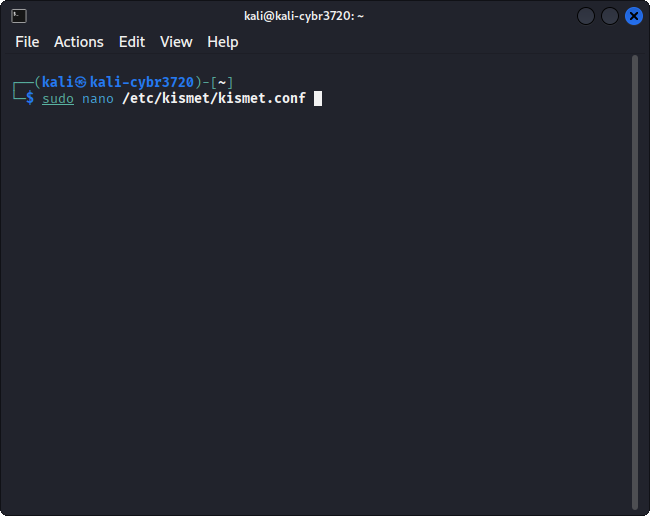

When you run this command, you will need provide the password for the kali user. The default password in the image provided for the class is `kali`.

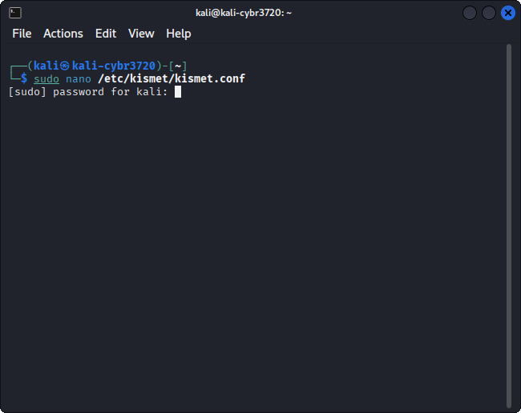

If you rememberd to use 'sudo', and there will be a "Read XXX lines" message at the bottom of the screen.

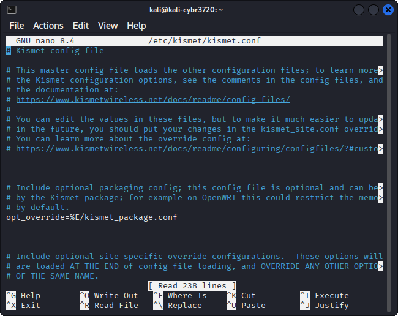

Use the down arrow key to scroll down to the section that starts with `# GPS Configuration`.

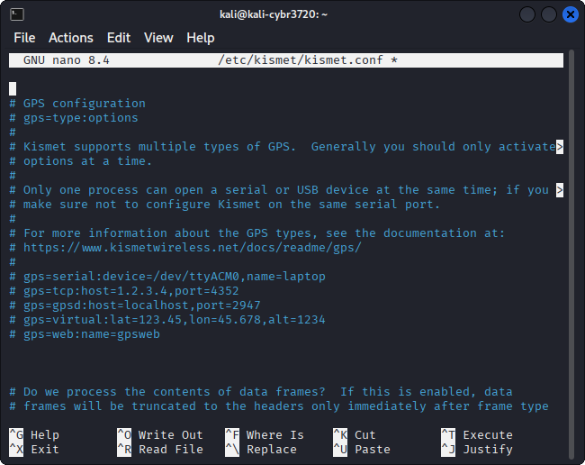

Uncomment the following lines by removing the `#` at the beginning:

```plaintext
gps=gpsd:host=localhost,port=2947
```

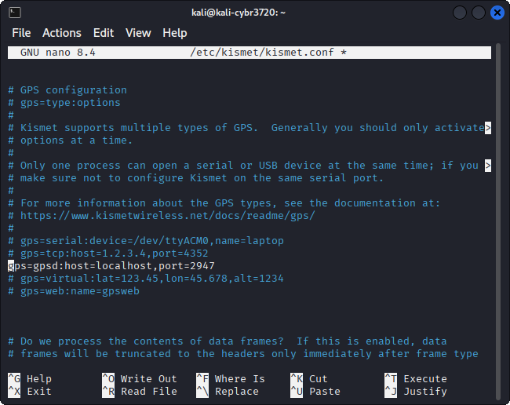

Use the `CTRL + O` key combination to write out the file. Press `Enter` to confirm the filename. Hit enter to save the file name it pops up with.

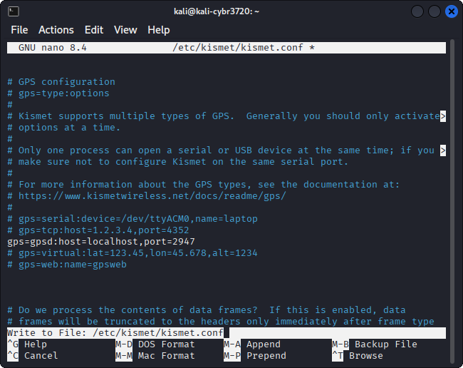

Look for the "Wrote XXX lines" message at the bottom of the screen. Use the `CTRL + X` key combination to exit nano.

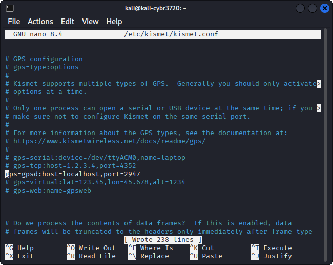

Test your GPS by moving to an outdoor area with a clear view of the sky and plugging in your USB GPS device. You can verify that GPSd is receiving data from the GPS device by running the following command:

```bash
cgps
```

You should see a list of satellites in use along with your current latitude and longitude.

### Running Kismet

To run Kismet, you will need to use `sudo` privileges. You can start Kismet by running the following command:

```bash
sudo kismet
```

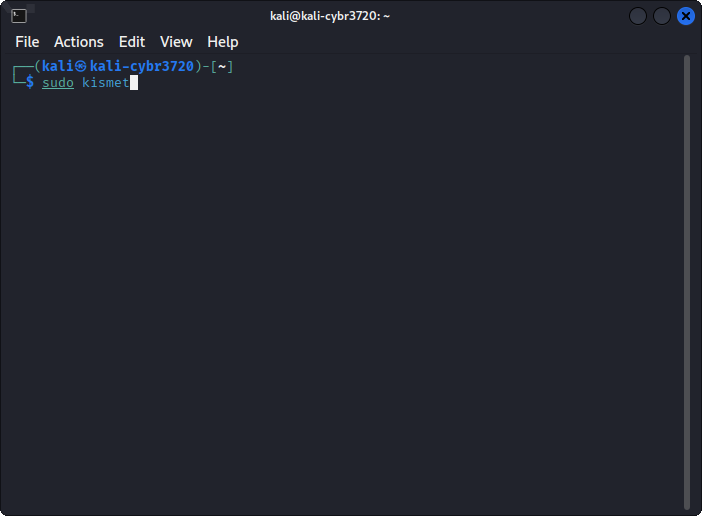

You will need provide the password for the kali user. The default password in the image provided for the class is `kali`. Hit enter to continue.

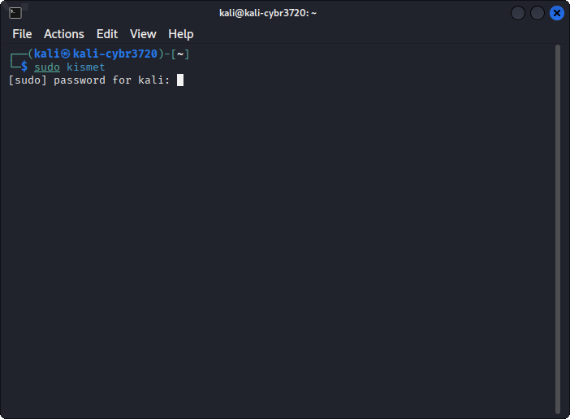

This is what Kismet looks like when it is running.

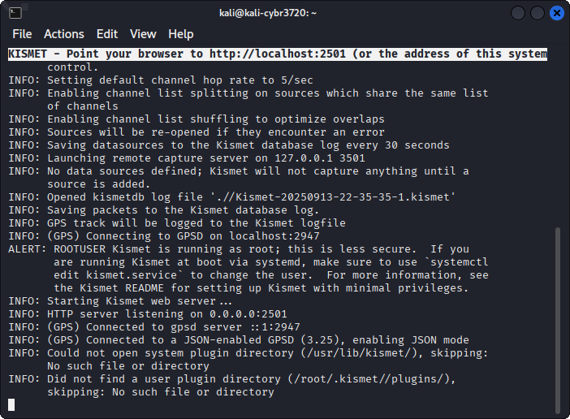

Open a web browser and navigate to `http://localhost:2501`. You will see the Kismet web interface. The first time you access the Kismet web interface, you will be prompted to set a username and password.

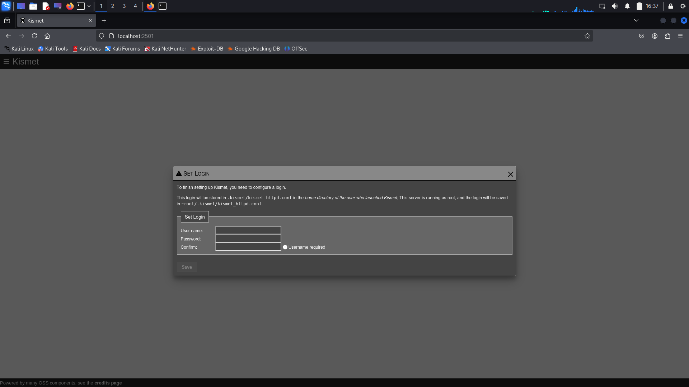

You can use any username and password you'd like, for my example I'm using `kali` for both the username and password. Click save to continue.

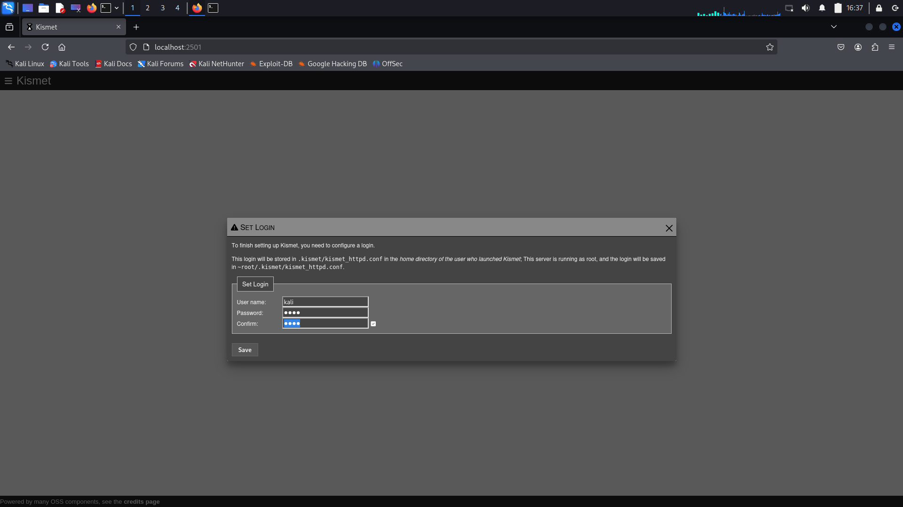

This is what the Kismet web interface looks like now that you have a password set.

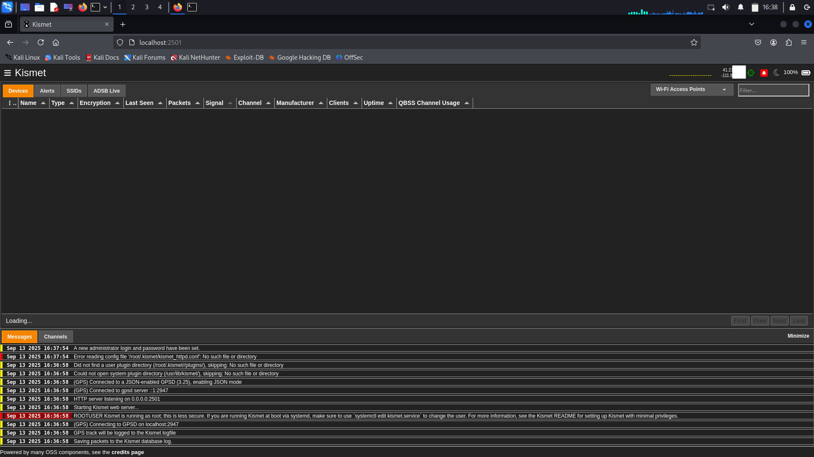

We now need to enable a data source. Click on the hamburger menu in the top left corner and select `Data Sources`.

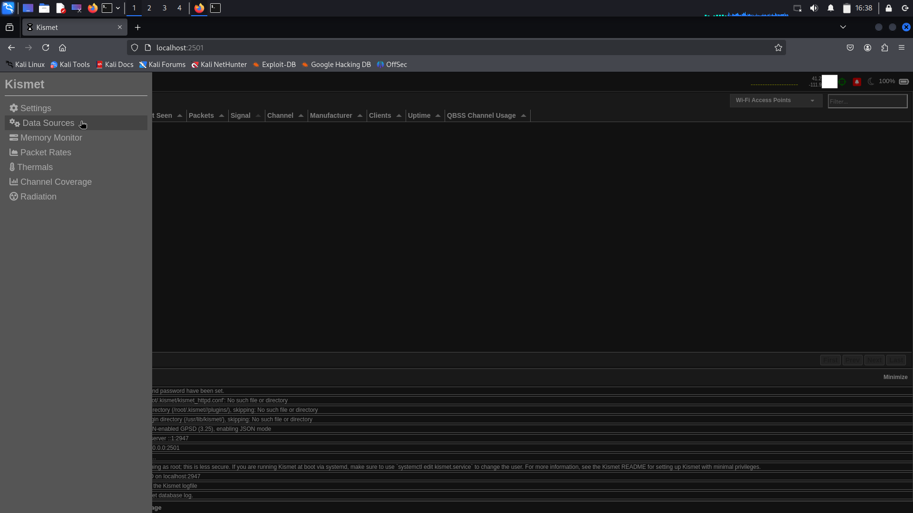

We want to enable the data source that you have been provided for the class. In my case, it is `wlan1`. If the computer you're using has a wlan adapter that isn't compatible with Linux, you might only see `wlan0` listed here.

Click the toggle switch to open up more information about the data source.

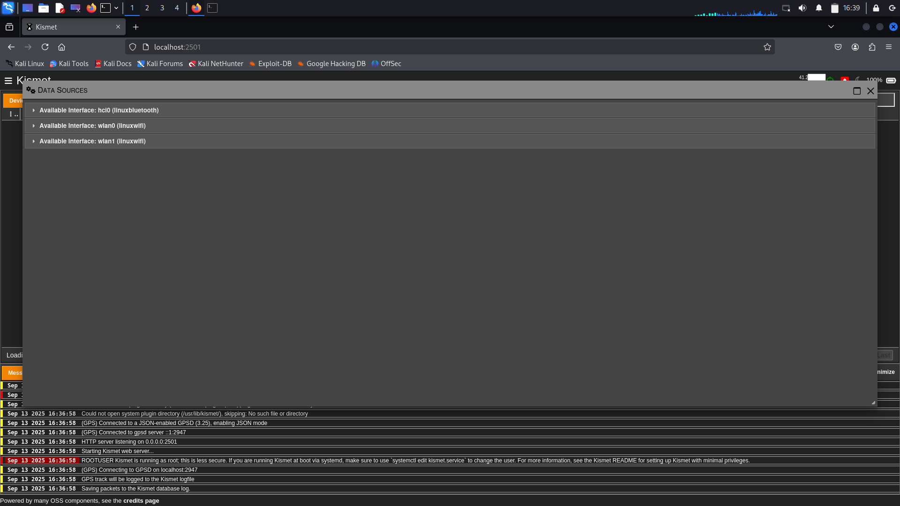

Another way to verify which data source to use is to look at the `Hardware` type listed for the source. The adapter provided for the class is an `Panda Wireless PAU0A`, which uses the `mt76x0u` driver. If you see that chipset listed, you know you're looking at the correct data source.

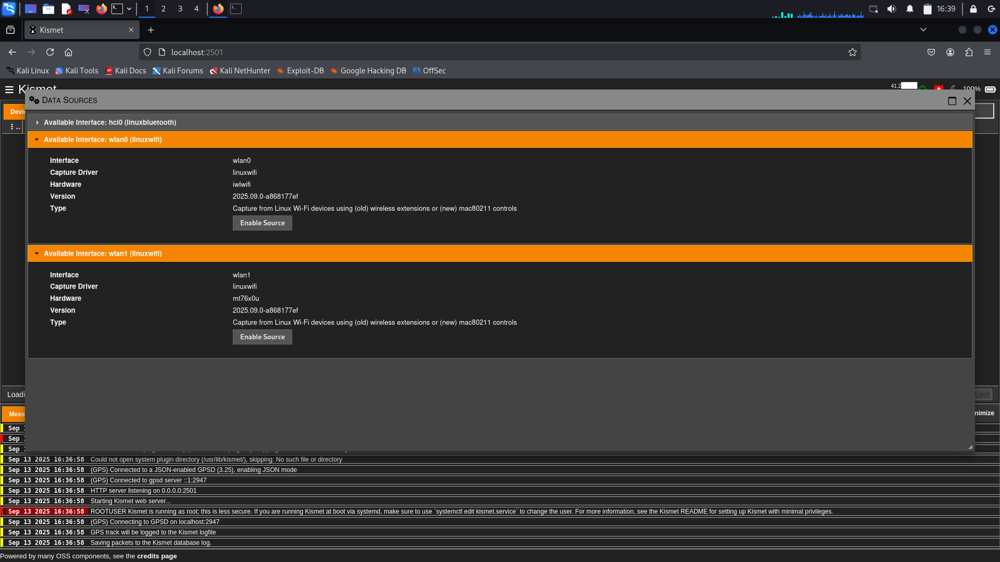

Click the `Enable` button to enable the data source. In this window we could make changes to the channel settings, but for this lesson we'll leave everything as the default settings.

Click on the X button at the top right of the Data Sources window to close it.

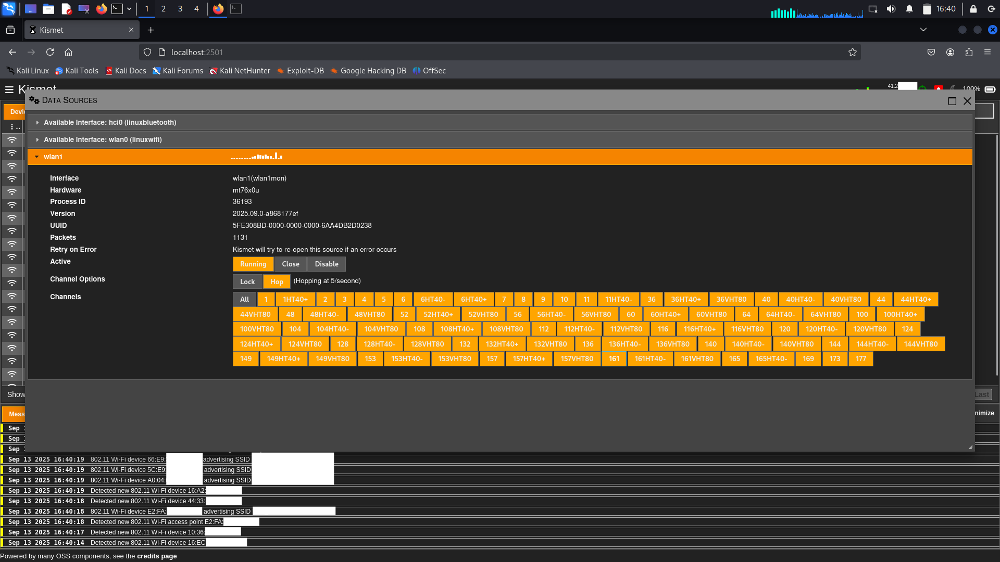

You should now see wireless networks being detected by Kismet. The green bullseye icon at the top right indicates that GPS data is being received.

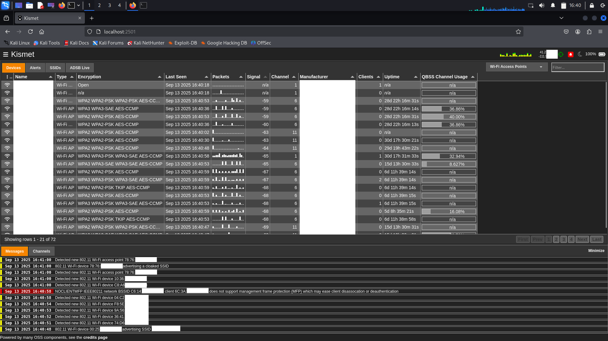

To reduce the amount of data being displayed, you can do so by clicking on the filter menu near the top right corner and selecting `Wi-Fi Access Points`.

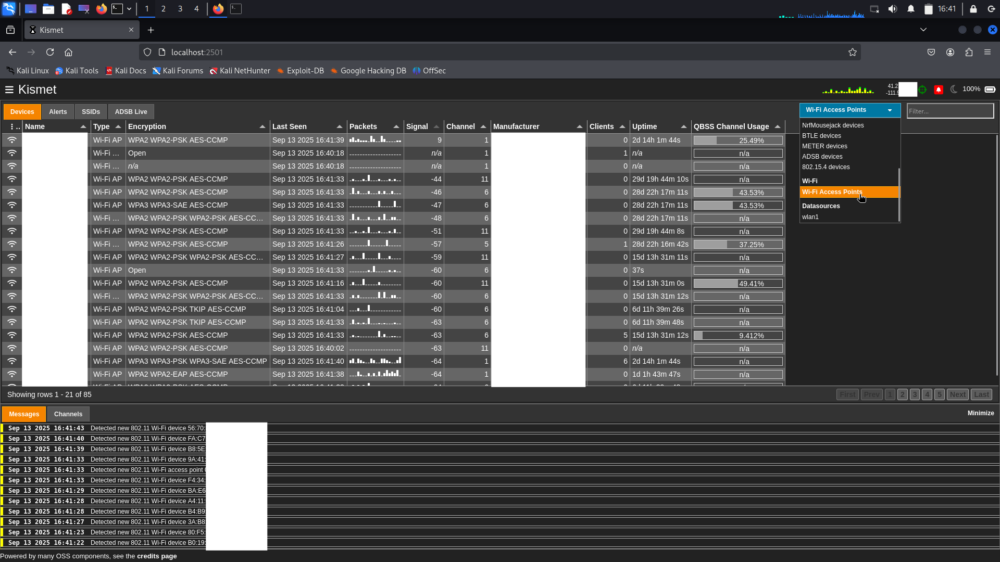

### Shutting down Kismet

When you've completed your wardriving session, you can shut down Kismet by going back to the terminal window where Kismet is running and pressing `CTRL + C`.

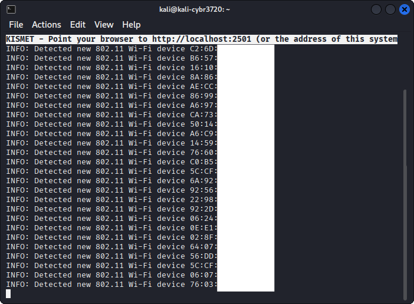

Kismet needs to shut down gracefully to ensure that the data is saved properly. Wait for the all of the terminal output and for the command prompt to return before closing the terminal window.

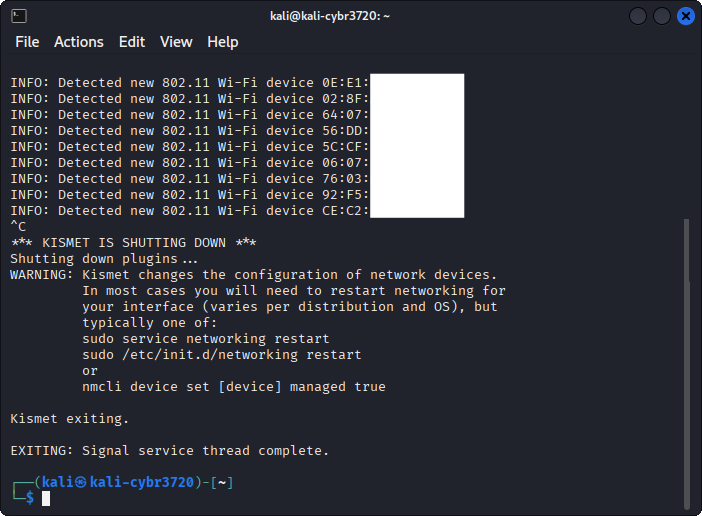

### Checking stats from Kismet

Kismet saves a database file called `Kismet-<timestamp>.kismet` in the directory you launched it from. We can see this file by running the `ls` command.

```bash
ls -lh *.kismet
```

Notice that the file is owned by root, since we ran Kismet with `sudo`. We can either change the ownership of the file to the kali user by running the following command:

```bash
sudo chown kali:kali Kismet-*.kismet
```

Or we can just use `sudo` when working with the file.

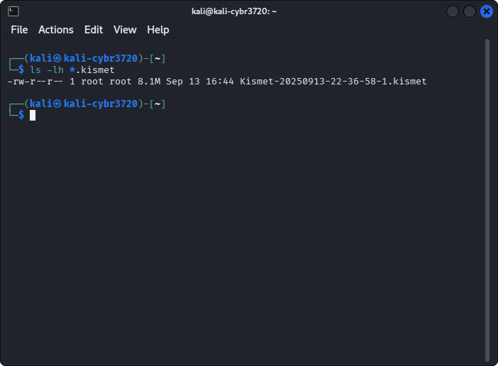

We can use the `kismetdb_statistics` command to view statistics about the data collected by Kismet. Run the following command to see a summary of the data:

```bash
sudo kismetdb_statistics --in Kismet-*.kismet
```

The number of interest for the assignment is the Devices count, which is the number of unique wireless devices detected during the wardriving session.

We also want to make sure that the number of `Packets with location` matches up well with the total number of packets. If the number of packets with location is very low, it indicates that GPS data was not being received properly during the wardriving session. If it is zero, then there was an issue with the GPS.

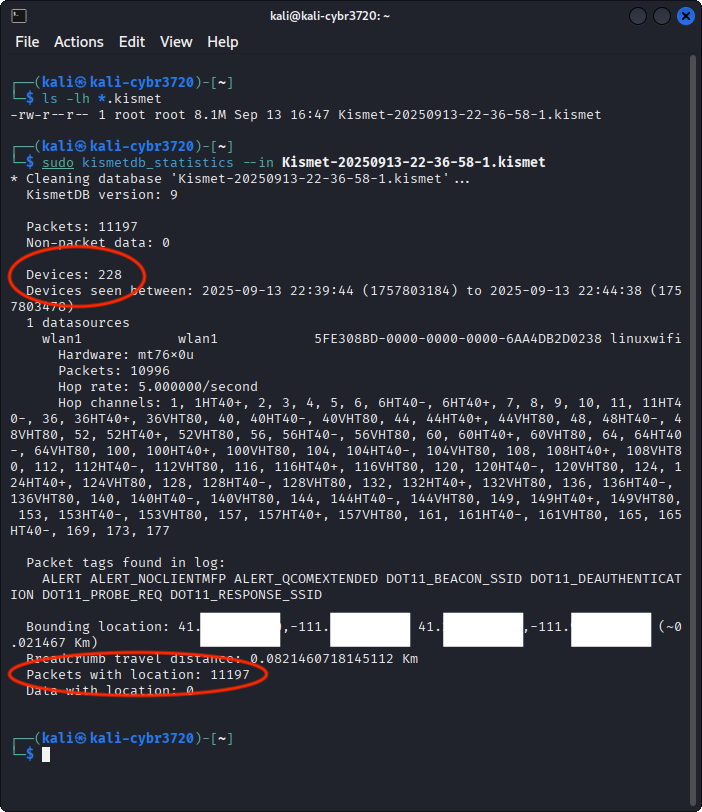

## Questions

For the assignment in Canvas, you need to send me proof that you have mapped out 10,000 unique Wi-Fi Access Points (APs) with GPS data.

The first method you can do is to attach the Kismet database file(s) along with a summary of how many each file contains to the assignment in Canvas.

Another way is to create an account at <https://wigle.net/>,  upload your Kismet file(s) there, and then attach a screenshot of your user account page to the assignment in Canvas.
